# Senior Engineer's Complete Full-Stack Development Tutorial Series

> **A comprehensive, production-ready guide to modern full-stack development**  
> Written from a Senior Engineer's perspective with real-world applications, best practices, and battle-tested patterns.

---

## 📚 Table of Contents

### 1. Frontend Development

- **[React & Next.js with TypeScript](./01-frontend/01-react-nextjs-typescript.md)** - Modern React patterns and Next.js 14+ features
- **[State Management & API Integration](./01-frontend/02-state-management-api.md)** - Redux, Zustand, React Query, and data fetching
- **[Rendering Strategies: SSR, SSG, CSR](./01-frontend/03-rendering-strategies.md)** - When and how to use each rendering method
- **[Performance Optimization](./01-frontend/04-performance-optimization.md)** - Bundle splitting, lazy loading, and Core Web Vitals
- **[SEO Best Practices](./01-frontend/05-seo-best-practices.md)** - Meta tags, structured data, and Next.js SEO
- **[Tailwind CSS & Component Libraries](./01-frontend/06-tailwind-component-libraries.md)** - Utility-first CSS and design systems

### 2. Backend Development

- **[Node.js & Express Fundamentals](./02-backend/01-nodejs-express-frameworks.md)** - Modern backend architecture
- **[REST API & GraphQL](./02-backend/02-rest-api-graphql-development.md)** - API design and implementation
- **[Authentication Systems](./02-backend/03-authentication-jwt-oauth-session.md)** - JWT, OAuth, and session-based auth
- **[File Storage & Media Processing](./02-backend/04-file-storage-media-processing.md)** - S3, Cloudinary, and image optimization
- **[Payment Integration with Stripe](./02-backend/05-payment-integration-stripe.md)** - Subscriptions, webhooks, and security
- **[Email & SMS Services](./02-backend/06-email-sms-services.md)** - SendGrid, Twilio, and templating
- **[Real-time Features with WebSockets](./02-backend/07-websockets-realtime.md)** - Socket.io and real-time updates
- **[Background Jobs & Queues](./02-backend/08-background-jobs-queues.md)** - Bull, Redis, and job processing
- **[Third-party Integrations](./02-backend/09-third-party-integrations.md)** - APIs, webhooks, and external services

### 3. Database Engineering

- **[PostgreSQL Deep Dive](./03-database/01-postgresql.md)** - Relational database mastery
- **[MongoDB & NoSQL Patterns](./03-database/02-mongodb-nosql.md)** - Document databases and when to use them
- **[Database Design & Relationships](./03-database/03-database-design.md)** - Normalization, indexes, and schema design
- **[Query Optimization & Indexing](./03-database/04-query-optimization.md)** - Performance tuning and explain plans
- **[ORMs: Prisma & TypeORM](./03-database/05-orms-prisma-typeorm.md)** - Type-safe database access
- **[Database Scaling Strategies](./03-database/06-scaling-strategies.md)** - Replication, sharding, and caching

### 4. DevOps & Infrastructure

- **[Docker Containerization](./04-devops/01-docker-containers.md)** - Containers, Docker Compose, and best practices
- **[CI/CD with GitHub Actions](./04-devops/02-cicd-github-actions.md)** - Automated testing and deployment
- **[Cloud Deployment (AWS & GCP)](./04-devops/03-cloud-deployment.md)** - EC2, Lambda, Cloud Run, and more
- **[Infrastructure as Code](./04-devops/04-infrastructure-as-code.md)** - Terraform and CloudFormation
- **[Monitoring & Logging](./04-devops/05-monitoring-logging.md)** - Observability, metrics, and debugging

### 5. Security Engineering

- **[HTTPS & Secure Protocols](./05-security/01-https-secure-protocols.md)** - TLS, certificates, and encryption
- **[Input Validation & Sanitization](./05-security/02-validation-sanitization.md)** - Preventing injection attacks
- **[CORS & Security Headers](./05-security/03-cors-security-headers.md)** - Cross-origin security
- **[Rate Limiting & Throttling](./05-security/04-rate-limiting.md)** - Preventing abuse and DDoS
- **[Secure Authentication Practices](./05-security/05-secure-auth-practices.md)** - Password hashing, MFA, and token security

### 6. Software Architecture

- **[Monolithic vs Microservices](./06-architecture/01-monolithic-vs-microservices.md)** - Choosing the right architecture
- **[Clean Code Principles](./06-architecture/02-solid-dry-kiss.md)** - SOLID, DRY, and KISS in practice
- **[Scalable Architecture Patterns](./06-architecture/03-scalable-patterns.md)** - Event-driven, CQRS, and more
- **[API Design Best Practices](./06-architecture/04-api-design.md)** - RESTful design and versioning

### 7. AI Integration

- **[OpenAI & Anthropic APIs](./07-ai-integration/01-openai-anthropic.md)** - GPT-4, Claude, and prompt engineering
- **[Speech-to-Text & Auto-Captions](./07-ai-integration/02-speech-to-text.md)** - Whisper and transcription services
- **[Content Recommendations](./07-ai-integration/03-content-recommendations.md)** - ML-powered recommendations
- **[Vector Databases & Embeddings](./07-ai-integration/04-vector-databases.md)** - Pinecone, Weaviate, and semantic search

---

## 🎯 How to Use This Tutorial Series

### For Beginners

Start with the fundamentals in Frontend and Backend sections, then progressively move to Database and Security topics.

### For Intermediate Developers

Focus on architecture patterns, performance optimization, and DevOps practices to level up your skills.

### For Advanced Engineers

Deep dive into scaling strategies, microservices architecture, and AI integration for cutting-edge applications.

---

## 🏗️ Real-World Project Examples

Throughout these tutorials, we'll build components of real applications:

- **E-commerce Platform** - Payment processing, inventory, and user management
- **Social Media App** - Real-time chat, file uploads, and content feeds
- **SaaS Dashboard** - Authentication, billing, and analytics
- **AI-Powered Tool** - Content generation and semantic search

---

## 🛠️ Tech Stack Overview

```typescript
{
  "frontend": {
    "framework": "Next.js 14+",
    "language": "TypeScript",
    "styling": "Tailwind CSS",
    "stateManagement": ["Zustand", "React Query"],
    "testing": ["Jest", "React Testing Library"]
  },
  "backend": {
    "runtime": "Node.js 20+",
    "framework": "Express.js",
    "apis": ["REST", "GraphQL"],
    "authentication": ["JWT", "OAuth 2.0", "Passport.js"],
    "testing": ["Jest", "Supertest"]
  },
  "database": {
    "relational": "PostgreSQL",
    "nosql": "MongoDB",
    "orm": ["Prisma", "TypeORM"],
    "caching": "Redis"
  },
  "devops": {
    "containerization": "Docker",
    "cicd": "GitHub Actions",
    "cloud": ["AWS", "Google Cloud"],
    "monitoring": ["DataDog", "Sentry"]
  },
  "ai": {
    "llm": ["OpenAI GPT-4", "Anthropic Claude"],
    "vectorDb": ["Pinecone", "Weaviate"],
    "embeddings": "OpenAI text-embedding-3"
  }
}
```

---

## 📖 Learning Path

```mermaid
graph TD
    A[Start Here] --> B[Frontend Basics]
    B --> C[Backend Fundamentals]
    C --> D[Database Design]
    D --> E[Security Essentials]
    E --> F[DevOps & Deployment]
    F --> G[Architecture Patterns]
    G --> H[AI Integration]
    H --> I[Production Ready! 🚀]
```



---

## 💡 What Makes This Different

- ✅ **Production-Ready Code** - Not just tutorials, but code you can use in real projects
- ✅ **Battle-Tested Patterns** - Techniques used in companies serving millions of users
- ✅ **Modern Stack** - Latest versions and best practices (2025-2026)
- ✅ **Complete Examples** - Full, working code snippets with explanations
- ✅ **Common Pitfalls** - Learn what NOT to do from real-world mistakes
- ✅ **Performance First** - Optimization baked in from the start
- ✅ **Security Minded** - OWASP Top 10 and security best practices throughout

---

## 🤝 Contributing

Found an error or have a suggestion? This is a living document that evolves with the industry.

---

## 📄 License

MIT License - Use this knowledge to build amazing things!

---

**Ready to become a Senior Engineer?** Start with [React & Next.js with TypeScript](./01-frontend/01-react-nextjs-typescript.md) →
